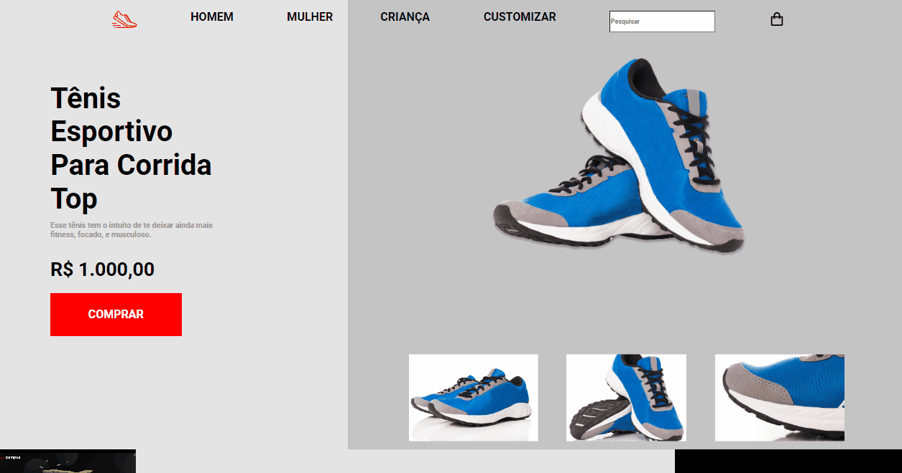

<h1>  </h1>

#  RocketShoes

<h2 align="center">  Mini e-commerce de calçados esportivos. </h2>

# Sobre

 Este é um projeto da Rocketseat, consiste em fazer um mini e-comerce de calçados esportivos. 

 <h1> Desafios </h1>

 
 - O ponteiro do mouse deverá ter o comportamento de click nos **menus, footer** e nos **botões** da página. ✅ 

 
 - Adicionar um vídeo do youtube no local da imagem que representa um video. ✅  

  
 - Deverá ter uma linha indicativa na foto que está aparecendo maximizada na galeria. ✅  

  # Layout

 Disponivel para desktop 

  <h1>  </h1>
  

  # Tecnologias

 <h3> Tecnologias ultilizadas nesse projeto </h3>

- HTML  
- CSS
 

  <h2>  Made by <a href="https://www.instagram.com/julius__caezar/">Julius caezar </a>  e Rocketseat </h2>